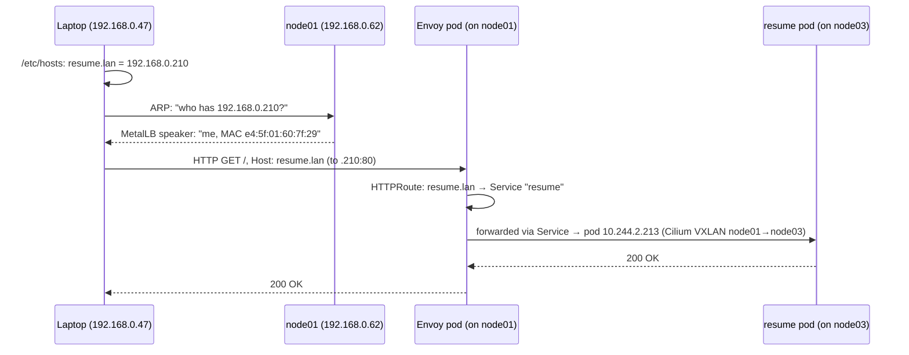

# How traffic reaches the cluster: Cilium, MetalLB and Envoy Gateway

A beginner-friendly walkthrough of what happens between typing
`http://resume.lan` into a browser and the resume site answering. It explains
the three networking components this cluster runs, what each one is
responsible for, and — just as important — what each one is *not*
responsible for.

Every address, port and name below is real and was read from the live
cluster. Commands to see each piece for yourself are at the end.

> This covers the **LAN** path (your laptop at home → cluster). The public
> path via Cloudflare (`juangar.com`) is in
> [`public-access-explained.md`](public-access-explained.md); it reuses
> everything here and adds a front section.

---

## The one-paragraph version

Your laptop wants to talk to `192.168.0.210`. **MetalLB** makes one of the
Pis answer to that address, so the packet arrives at a real machine.
**Envoy** (run by Envoy Gateway) is waiting there; it reads which website
you asked for and picks the right app. **Cilium** is the plumbing that lets
Envoy's request actually reach the app's container, even when that container
is on a different Pi. Three jobs: *get to the building*, *find the right
department*, *walk the corridors*.

---

## The analogy we'll use: a company campus

Picture the cluster as a small company campus on an ordinary residential
street.

| Real thing | In the analogy |
| --- | --- |
| Your home LAN (`192.168.0.x`) | The street. Every house and building has a street number. |
| The three Pis (`node01`–`node03`) | Three office buildings on the campus. |
| A pod (a running container) | A person working at a desk inside one of the buildings. |
| A pod IP (`10.244.x.x`) | That person's desk number. Internal only — the postman has never heard of it. And people move desks: when a pod restarts, it usually gets a new one. |
| A Service's ClusterIP (`10.x.x.x`) | A department's phone extension. It never changes, and the switchboard forwards calls to whoever is currently sitting in that department. |
| `192.168.0.210` | The campus's public front-door address, printed on the website. |
| **MetalLB** | The person who answers when someone on the street shouts "who's at number 210?" |
| **Envoy** | The receptionist behind that front door, who reads who each visitor has come to see and sends them to the right department. |
| **Cilium** | The corridors and internal mail system connecting desks — including a covered walkway between buildings. |

Keep this picture in mind; each section below zooms into one role.

---

## A request's journey, step by step

Which Pi each pod sits on below is a snapshot from when this was written.
Pods move — after a reboot, a rollout, a node failure — and there are two
of both Envoy and the resume app, on different Pis. `kubectl get pods -A -o
wide` shows today's placement; the steps are the same whichever Pis they
are.



1. **Name → address.** Your laptop looks up `resume.lan`. There's no real DNS
   for `.lan`, so it's in `/etc/hosts`, which says `192.168.0.210`.
2. **Address → machine (ARP).** `192.168.0.210` is on the same street as your
   laptop, so the laptop has to find out which physical network card owns
   it. It shouts "who has `192.168.0.210`?" to everyone on the LAN. MetalLB,
   running on node01, answers "me — send it to this MAC address." *(This is
   MetalLB's whole job. See below.)*
3. **Machine → Envoy.** The packet arrives at node01, port 80. Kubernetes'
   own traffic rules on the node (kube-proxy's iptables rules) hand it to the
   Envoy pod running on node01 (there's a second one on another Pi, as a
   standby — see below).
4. **Envoy picks the app.** Envoy reads the HTTP `Host` header —
   `resume.lan` — and checks its routing table (the `HTTPRoute`s). It finds
   "`resume.lan` → the `resume` Service" and forwards the request there.
5. **Service → pod.** The `resume` Service has a stable address
   (`10.99.101.110`) that gets translated into the address of an actual
   running resume pod — right now `10.244.2.213`, on **node03**.
6. **Across the campus (Cilium).** node01 and node03 are different machines.
   Cilium carries the packet from Envoy's pod on node01 to the resume pod on
   node03, wrapped up so the LAN can carry it (see "VXLAN" below).
7. The reply retraces the same path back to your browser.

---

## MetalLB: answering the door

### The problem it solves

In a cloud (AWS, GCP…), asking Kubernetes for a `type: LoadBalancer` Service
makes the cloud provider create a real load balancer with a real IP.
On a home LAN there's no cloud provider. Without MetalLB the Service would
sit with `EXTERNAL-IP <pending>` forever — you'd be asking for something
nobody on the premises knows how to provide.

MetalLB is that provider for bare metal. It does two things:

1. **Hands out addresses.** The controller picks a free IP from the pool
   `192.168.0.210`–`192.168.0.230` (`platform/metallb/ipaddresspool.yaml`)
   and writes it onto the Service. Envoy's Service got `.210`.
2. **Answers for them.** A *speaker* pod runs on every Pi. One of them is
   elected to answer ARP questions about each IP.

### ARP, in plain terms

Computers on the same LAN don't actually deliver to IP addresses — they
deliver to **MAC addresses**, the hardware ID burned into each network card.
IP is the street number; MAC is the specific letterbox. ARP (Address
Resolution Protocol) is how you translate one to the other: you shout down
the street "who's at number 210?" and whoever lives there shouts back "me,
here's my letterbox." Your laptop remembers the answer for a while (its ARP
cache — `arp -n 192.168.0.210` shows it).

`192.168.0.210` isn't configured on any Pi's network card. It's a "virtual"
address: the only reason traffic reaches a Pi is that MetalLB's speaker
answers the shout. If nobody answers, the packet has nowhere to go — the
address exists on paper only.

### Only one Pi answers at a time

In L2 mode, exactly one speaker answers for each IP at a time; if that Pi
dies, another takes over and announces the IP from itself. (L2 means "layer
2", the ARP/MAC level of networking. MetalLB also has a BGP mode, which
talks to a router instead; this LAN has no BGP-capable router, so it's off —
that's why `frrk8s.enabled: false` in the values.)

Which Pi answers is affected by Envoy's Service setting
`externalTrafficPolicy: Local`: *"only send outside traffic to a node that
has an Envoy pod on it."* MetalLB respects that and only lets such nodes
answer.

The upside of `Local`: the app sees your laptop's real IP instead of some
intermediate hop's (visible in the resume pod's logs as
`X-Forwarded-For: 192.168.0.47`). The catch: MetalLB can only answer from a
Pi that has an Envoy pod, so if there's only one Envoy, its Pi is a single
point of failure. That's why Envoy runs **two replicas, forced onto
different Pis** (`platform/envoy-gateway/envoyproxy.yaml`): one Pi answers
for `.210`, and the other already has a ready Envoy and is allowed to take
over. In the analogy: two receptionists in two buildings, so closing one
building doesn't close the front door. What that bought, measured, is in
[What happens when a Pi dies](#what-happens-when-a-pi-dies-measured).

### The trap this cluster fell into

kubeadm puts the label `node.kubernetes.io/exclude-from-external-load-balancers`
on every control-plane node, meaning "don't send load-balancer traffic here."
Here, *all three* Pis are control-plane nodes. MetalLB honours the label, so
it refused to answer from any of them: the Service got its IP, and the IP
was silently unreachable. In the analogy, someone was on duty in every
building to answer "who's at number 210?", but every building had a sign
saying "no visitors," so all of them stayed quiet.

`speaker.ignoreExcludeLB: true` in `metallb-values.yaml` tells MetalLB to
ignore that sign. Full story in
[`architecture.md`](architecture.md#loadbalancer-ips-metallb-l2-mode).

### What MetalLB does *not* do

MetalLB never touches your traffic. It doesn't forward, inspect or balance
anything — it only makes sure packets addressed to `.210` land on the right
Pi. Everything after that is someone else's job. The name "LB" is a bit
misleading; "IP announcer" would be closer.

### A cousin: kube-vip

The same trick is used once more on this cluster, by a different tool.
`192.168.0.200` is the address `kubectl` talks to (the Kubernetes API), and
**kube-vip** answers ARP for it so that `kubectl` still works if one Pi goes
down. That's why MetalLB's pool starts at `.210`: two different tools
answering for the same address would make both flaky.

| Address | Answered by | Used for |
| --- | --- | --- |
| `192.168.0.62`–`.64` | each Pi's own network card | the Pis themselves (SSH etc.) |
| `192.168.0.200` | kube-vip | the Kubernetes API (`kubectl`) |
| `192.168.0.210`–`.230` | MetalLB | LoadBalancer Services (today: just Envoy, `.210`) |
| `192.168.0.33`–`.199` | your router (DHCP) | laptops, phones, etc. |

---

## Envoy Gateway: the receptionist

### The problem it solves

There's one front door (`.210`) but several apps behind it —
`resume.lan`, `grafana.lan`, their `.home.juangar.com` twins, and
`juangar.com` (which arrives through the Cloudflare tunnel rather than via
`.210`, but lands at the same receptionist). Something has to look
at each visitor and decide where they go. That's a **reverse proxy**, and
Envoy is the one used here.

How does Envoy know what you want if everything arrives at the same address?
Browsers send a `Host` header with every request — literally the name you
typed. The visitor's badge says "I'm here for resume.lan," and the
receptionist reads the badge.

### Envoy vs. Envoy Gateway

Two separate things with similar names:

- **Envoy** — the proxy that actually handles requests (the receptionist).
  Runs as two pods named `envoy-envoy-gateway-system-eg-…`, on different
  Pis.
- **Envoy Gateway** — a controller that *configures* Envoy (the office
  manager who hands the receptionist an updated directory). It watches
  Kubernetes for routing rules and translates them into Envoy's
  configuration. It never sees your traffic. Runs as a single
  `envoy-gateway-…` pod. That's fine as one copy: if it's down, the Envoy
  pods keep serving with the last configuration they received — you just
  can't change routes until it's back.

### The routing rules: Gateway API

Routing is described with standard Kubernetes objects called the **Gateway
API**. Three layers, owned by different people in a real company:

| Object | In this repo | Analogy |
| --- | --- | --- |
| `GatewayClass` | `platform/envoy-gateway/gatewayclass.yaml` | "Our reception desks are run by Envoy." Chooses the implementation. |
| `Gateway` | `platform/envoy-gateway/gateway.yaml` (`eg`) | The front door itself, with its *listeners*: "open on port 80 for anyone", plus one door on port 443 per HTTPS hostname, each with that hostname's certificate. Creating it is what makes Envoy Gateway start Envoy pods and a `LoadBalancer` Service — which is what MetalLB then gives `.210`. |
| `HTTPRoute` | `apps/resume/templates/httproute.yaml`; Grafana's comes from its chart | A line in the lobby directory: "`resume.lan` → the `resume` Service, port 80." Each app brings its own, and names which of the Gateway's listeners (doors) it's posted at. |

So adding a plain-HTTP website never touches the Gateway, and never touches
MetalLB: the app ships an `HTTPRoute` with its hostname, and the existing
front door starts serving it. An HTTPS name on the LAN
(`something.home.juangar.com`) needs two more pieces: a cert-manager
`Certificate` and a matching HTTPS listener on the Gateway — the door needs
its own lock and key. See `docs/architecture.md`.

### What Envoy does *not* do

It doesn't get packets to the Pi (MetalLB's job) and it doesn't move packets
between Pis (Cilium's job). It works at the level of HTTP requests — URLs,
headers, hostnames — rather than individual packets.

(This is the same role Traefik used to play. Traefik used a different
approach — it listened on port 80 of *every* Pi, so any Pi's IP worked. It
has since been removed.)

---

## Cilium: the corridors

### The problem it solves

Every pod gets its own IP address, and Kubernetes has one strict rule:
**every pod must be able to reach every other pod directly, whichever node
it's on.** Kubernetes itself doesn't implement that — it delegates to a
**CNI plugin** (Container Network Interface). Cilium is this cluster's CNI.
Without it, pods don't get addresses at all and nodes show `NotReady`.

### What it does

- **Gives each pod a desk number.** Each Pi owns a block of pod addresses:
  node01 `10.244.0.0/24`, node02 `10.244.1.0/24`, node03 `10.244.2.0/24`
  (`/24` = 256 addresses). The resume pod is `10.244.2.213` because it's on
  node03.
- **Connects pods across Pis (VXLAN).** Your router has never heard of
  `10.244.x.x` and would drop such packets. So when Envoy on node01 sends to
  `10.244.2.213`, Cilium puts the whole packet inside another packet
  addressed from `192.168.0.62` to `192.168.0.64` — a letter inside an
  envelope addressed to the other building. node03's Cilium opens the outer
  envelope and delivers the inner letter. That wrapping is called
  **encapsulation**; VXLAN is the format (`routing-mode: tunnel`,
  `tunnel-protocol: vxlan` in Cilium's config).
- **Network policy.** Cilium can enforce firewall rules between pods ("only
  Envoy may talk to the resume pod"). None are defined yet, so everything
  can reach everything.

### What Cilium does *not* do — on this cluster

Cilium can do a lot more, and some of it overlaps with the other two tools.
This cluster deliberately switches those parts off so that each job has
exactly one owner:

- **Handing out LoadBalancer IPs / answering ARP** — Cilium has its own
  version of MetalLB. It's disabled (`defaultLBServiceIPAM: none`) so it and
  MetalLB can never both claim `.210`. MetalLB is used instead because it
  works with any CNI, so the same design carries to other clusters.
- **Service address translation** — turning a Service's stable address
  (`10.99.101.110`) into a pod address (`10.244.2.213`). Cilium can do this
  ("kube-proxy replacement"), but here it's `kubeProxyReplacement: false`,
  so Kubernetes' standard **kube-proxy** does it with iptables rules on each
  Pi. It's the switchboard from the analogy.
- **Gateway API** — Cilium has its own implementation, but it requires
  kube-proxy replacement, which is why Envoy Gateway is used.

---

## What happens when a Pi dies (measured)

Having two of something only helps if the second one takes over. This was
tested by rebooting one Pi at a time while a laptop requested the resume
site once per second and recorded two things: the HTTP result, and which
Pi's MAC address was answering for `192.168.0.210`. The cluster was changed
between tests, so each row shows what one more layer of redundancy bought.

| Pi rebooted | Setup at the time | Site fully down | Partly failing |
| --- | --- | --- | --- |
| node01 | 1 Envoy (on node01), 1 resume | **~4½ minutes** | – |
| node03 | 2 Envoy, 1 resume (on node03) | **~3¾ minutes** | – |
| node02 | 2 Envoy, 2 resume — today's setup | **none** | 71 seconds, half of requests |

### Test 1 — one Envoy: the front door had nowhere to go

The only Envoy was on node01. When node01 went down, MetalLB wasn't allowed
to answer for `.210` from the other Pis (no Envoy there), so nothing
answered at all. The site returned only once node01 finished rebooting and
its Envoy started up again. Had node01 stayed dead, it would have been worse:
Kubernetes waits about **5 minutes** after a Pi stops responding before it
moves that Pi's pods elsewhere, and only then could the IP follow.

Meanwhile the Kubernetes API itself (`192.168.0.200`, kube-vip) moved to
node03 the instant node01 went down — `kubectl` never stopped working.
The control plane was already redundant; the path into the apps wasn't.

### Test 2 — two Envoys: the door moved in one second, the room behind it was empty

With Envoy on node02 and node03, rebooting node03 (which was answering for
`.210`) showed the IP move to node02 **within about one second** — the
laptop's ARP entry switched to node02's MAC. That part worked exactly as
designed.

But the site stayed down anyway, because the resume app still had only one
pod, on node03. node02's Envoy was answering: a request for a made-up
hostname got an instant `404`. Requests for `resume.lan` hung for 10 seconds
and then failed with `upstream connect error … connection timeout` — Envoy
had nowhere to send them. In the analogy: the receptionist moved buildings
in a second, but the only person you'd come to see was in the building that
closed.

Worth noticing: once node03 came back, MetalLB moved `.210` back to it.
The speakers pick which Pi answers by a fixed rule, so a returning Pi can
take the address back. That move caused no visible outage.

### Test 3 — two of everything: no outage, one awkward minute

With Envoy on node02 and node03, and the resume app on node01 and node02,
rebooting node02 caused no outage — but for **71 seconds, about half of
requests failed**, then everything returned to normal while node02 was
still rebooting.

Why half, and why 71 seconds? Envoy spreads requests across the resume pods
it knows about, alternating between them. When node02 died, its resume pod
vanished without telling anyone, and Envoy kept sending every second
request to it. Kubernetes only removes a pod from the list once it
concludes the pod's Pi is dead — and a Pi that stops responding isn't
declared dead until it's been silent for a while (about a minute here),
because a short network hiccup shouldn't trigger a failover. From that
moment on, every request succeeded.

The IP never moved in this test: node03 was answering for `.210` throughout,
and node03 was fine.

### What's still not redundant

- **The awkward minute.** Envoy could skip a dead pod on its own instead of
  waiting for Kubernetes: *retries* (resend a failed request to the other
  pod) and *passive health checks* (stop using a pod after a few failures).
  Envoy Gateway configures both with a `BackendTrafficPolicy`. Not set up
  yet.
- **Grafana.** Its data lives on node03's own disk (`local-path` storage
  isn't replicated), so it can't run anywhere else. If node03 is down,
  Grafana is down.
- **The microSD cards.** During these tests node03 kept dropping out on its
  own. The cause turned out to be Grafana: its memory limit was too small,
  so it re-read its files from node03's card nonstop and starved everything
  else sharing that card, etcd included. Raising the limit fixed it (see
  `docs/architecture.md`). But the underlying fragility is real: all three
  Pis run from microSD, and SSDs remain the biggest reliability upgrade
  available.

---

## Who does what — summary

| Question | Answered by | Where it's configured |
| --- | --- | --- |
| Which address is the front door? | MetalLB controller | `platform/metallb/ipaddresspool.yaml` |
| Which Pi answers for that address? | MetalLB speaker (via ARP) | `platform/metallb/l2advertisement.yaml`, `metallb-values.yaml` |
| Which app does this request belong to? | Envoy, configured by Envoy Gateway | `HTTPRoute`s + `platform/envoy-gateway/gateway.yaml` |
| Which pod backs this Service? | kube-proxy | automatic, from the Service's selector |
| How does a packet get to a pod on another Pi? | Cilium (VXLAN) | `cilium-values.yaml` |
| What's `resume.lan`'s address? | your laptop's `/etc/hosts` | outside the cluster |
| What's `resume.resume.svc.cluster.local`'s address, inside the cluster? | CoreDNS (`10.96.0.10`) | automatic |

### When something breaks, which layer?

| Symptom | Likely layer | First check |
| --- | --- | --- |
| Service stuck at `EXTERNAL-IP <pending>` | MetalLB controller | `kubectl get ipaddresspool -n metallb-system`; controller logs |
| Has an EXTERNAL-IP but times out from the laptop | MetalLB speaker / ARP | `kubectl describe svc -n envoy-gateway-system` → look for `announcing from node`; `arp -n 192.168.0.210` on the laptop |
| Connects, but `404` / wrong site | Envoy routing | `kubectl get httproute -A` — is the hostname there, and `Accepted`? |
| `503` from Envoy | the app, or the Service has no ready pods | `kubectl get pods,endpointslices -n <app>` |
| Pods can't reach each other, nodes `NotReady` | Cilium | `kubectl get pods -n kube-system -l k8s-app=cilium` |
| About half of requests fail for ~a minute, then it recovers on its own | a Pi just died; Kubernetes hasn't declared it dead yet | expected — see [What happens when a Pi dies](#what-happens-when-a-pi-dies-measured) |

---

## See it for yourself

```sh
# MetalLB: the IP, and which Pi is announcing it
kubectl get svc -n envoy-gateway-system
kubectl describe svc -n envoy-gateway-system | grep -A3 Events
arp -n 192.168.0.210            # on your laptop: which MAC answered
arp -n 192.168.0.62             # ...compare with node01's MAC

# Envoy: the front door and the directory
kubectl get gateway -n envoy-gateway-system
kubectl get httproute -A
curl -H 'Host: resume.lan' http://192.168.0.210/     # the Host header is all Envoy needs

# Cilium: each node's pod address block, and where pods landed
kubectl get nodes -o custom-columns=NAME:.metadata.name,PODCIDR:.spec.podCIDR
kubectl get pods -A -o wide
```

---

## Glossary

- **IP address** — a device's address on a network, like a street number.
  `192.168.0.x` is your LAN; `10.x` addresses here exist only inside the
  cluster.
- **MAC address** — the hardware ID of a network card. What actually gets
  used to deliver a packet on the local network.
- **ARP** — how a device finds the MAC address for an IP on its LAN ("who
  has 192.168.0.210?").
- **Port** — a numbered door on an IP address. Web traffic uses 80 (HTTP)
  and 443 (HTTPS).
- **Pod** — one or more containers running together, with one IP address.
- **Service** — a stable name and address in front of a changing set of
  pods. `ClusterIP` Services are reachable only inside the cluster;
  `LoadBalancer` Services also get an address on the LAN.
- **CNI** — the plugin that gives pods addresses and connects them (Cilium).
- **Reverse proxy** — a server that receives requests on behalf of other
  servers and forwards them (Envoy).
- **Host header** — the part of an HTTP request that says which website was
  asked for.
- **VXLAN / encapsulation** — wrapping a packet inside another packet so it
  can cross a network that doesn't understand the inner addresses.
- **CIDR (`/24`, `/16`)** — shorthand for a block of addresses. `/24` = 256
  addresses, `/16` = 65,536.
