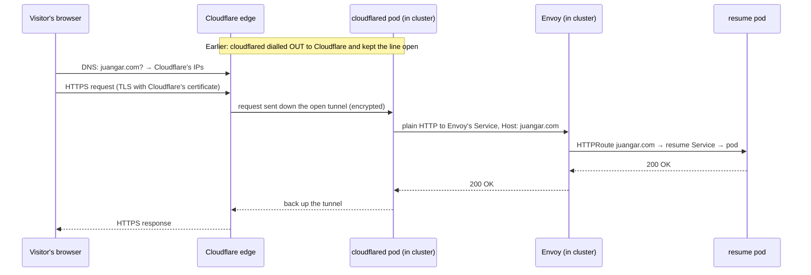

# How juangar.com reaches the cluster: Namecheap, Cloudflare and the tunnel

A beginner-friendly walkthrough of how a visitor anywhere on the internet
reaches the resume site at `https://juangar.com` — without your home IP
address being published and without opening a single port on your router.

> **Status: live** since 2026-09-28. The dashboard steps are in
> [`cloudflare-1password-setup.md`](cloudflare-1password-setup.md) (the
> *how*); this doc is the *why*, plus what went wrong on the way and how it
> was found ([The DNS trap](#the-dns-trap-when-the-route-cant-create-its-record),
> [Two red herrings](#two-red-herrings-on-the-way)). Names like the Envoy
> Service below are real and were read from the live cluster.
>
> It builds on [`networking-explained.md`](networking-explained.md), which
> covers everything from Envoy inward. Read that first if terms like
> "Envoy", "HTTPRoute" or "Service" are unfamiliar.

---

## The one-paragraph version

**Namecheap** is where you *own* `juangar.com`. **Cloudflare** is where
the world *looks it up*, and it answers "`juangar.com` is at Cloudflare."
Visitors connect to Cloudflare, never to your house. Meanwhile a small
program in the cluster, **cloudflared**, has already phoned Cloudflare from
the inside and kept the line open — the **tunnel**. Cloudflare passes each
visitor's request down that line, and a **route** you configured tells
cloudflared which in-cluster address to hand it to: Envoy, which serves the
resume site exactly as it does on the LAN.

---

## Part 1 — Owning a name vs. answering for it

### Namecheap: the land registry

When you buy a domain, you're buying an entry in a global register saying
"`juangar.com` belongs to Juan." Namecheap is the **registrar** — the office
that files that entry and renews it yearly.

But owning a plot of land doesn't tell anyone how to *get* there. For that,
people use the phone book.

### DNS: the phone book

**DNS** (Domain Name System) turns names into addresses. When a browser is
asked for `juangar.com`, it asks DNS and gets back an IP address to connect
to. The phone book is made of **records**:

| Record | Means | Example |
| --- | --- | --- |
| `A` | "This name is at this IPv4 address." | `example.com → 203.0.113.10` |
| `CNAME` | "This name is an alias — look up this other name instead." | `www.example.com → example.com` |
| `TXT` | Free-text notes, often used to prove you control a domain. | `_acme-challenge.… → "abc123"` |
| `MX` | "Email for this domain goes to this mail server." | `example.com → mail.provider.com` |

### Nameservers: which phone book is the official one

There isn't one giant phone book — each domain names which company's servers
hold *its* records. Those servers are its **nameservers**. The registrar's
record for your domain includes "the official phone book for `juangar.com`
is kept by …".

By default that's Namecheap's own nameservers. The setup changes it to two
Cloudflare nameservers (step 2 of the setup doc). After that:

- **Namecheap still owns the registration.** You still renew there. Nothing
  moved except "who answers questions about the name."
- **Cloudflare now answers every DNS question** about `juangar.com` and
  anything under it.
- It's reversible: set the nameservers back and Namecheap's phone book
  becomes official again.

In the analogy: the land registry (Namecheap) still says you own the plot;
you've just told it "for directions, ask Cloudflare's phone book."

**Why the setup doc warns about email.** Records don't follow the nameserver
switch automatically. Whatever is in Namecheap's phone book (e.g. `MX`
records for email) must be re-entered in Cloudflare's *before* switching —
otherwise the moment the switch takes effect, the world asks Cloudflare
"where does email for juangar.com go?" and gets no answer.

**Why it can take hours.** DNS answers are cached all over the internet for
a while, so the change spreads gradually ("propagation"). Cloudflare marks
the domain **Active** once it sees the switch.

---

## Part 2 — Why a tunnel, instead of the normal way

### The normal way, and why it's not used

Traditionally, you'd put an `A` record `juangar.com → <your home's public
IP>`, then tell your router "send anything arriving on port 443 to
`192.168.0.210`" (**port forwarding**). It works, but:

- Your home's IP address is published in the phone book for anyone to see —
  and to attack directly.
- You're opening a door in your router's firewall to the whole internet.
- Home IPs change. When your ISP gives you a new one, the site breaks until
  you update DNS.
- Some ISPs share one public IP among many homes (CGNAT), and then port
  forwarding can't work at all.

### The tunnel: a phone line opened from the inside

Your router is like a building with a strict doorman: **nobody from outside
gets in**, but anyone inside can make outgoing calls. That's how every
home network works by default, and it's why a laptop can browse the web
without the internet being able to reach the laptop.

Cloudflare Tunnel uses that. Instead of opening a door, you put a staff
member inside — **cloudflared** — who **calls Cloudflare from the inside and
keeps the line open**. Cloudflare's own docs describe it as initiating "an
outbound connection through your firewall from the origin to the Cloudflare
global network." When a visitor arrives at Cloudflare asking for
`juangar.com`, Cloudflare sends the request down that already-open line;
cloudflared carries it into the cluster and sends the answer back up.

What that buys:

- **No ports opened** on your router. The doorman's rule stays "nobody in."
- **Your home IP is never published.** DNS points at Cloudflare, not you.
- **No broken site when your IP changes.** cloudflared simply reconnects
  from the new one.
- Works behind CGNAT, because it only needs outgoing connections.

The trade-off: every visitor goes through Cloudflare, so Cloudflare can see
the traffic, and you depend on it being up.

---

## Part 3 — The pieces of the tunnel

### The tunnel itself

In Cloudflare, a **tunnel** is a named object with a unique ID (a UUID). It
isn't a connection; it's the *account* the connections belong to. Think of
it as a phone number at Cloudflare HQ reserved for your building.

### The tunnel token: the staff ID badge

When you create the tunnel, Cloudflare shows an install command containing a
long **token** (starting `eyJ…`). The token is what proves "this caller is
really the `pi-cluster` tunnel." Anyone holding it can connect *as your
tunnel* — so it's a secret. It gets stored in 1Password and pulled into the
cluster automatically (Part 5), never committed to git.

Don't mix it up with the tunnel's **ID**, which the dashboard shows much
more prominently: a 36-character UUID like `ff926564-0adf-…`. The ID is just
the tunnel's name tag — cloudflared can't connect with it. The token is a
long base64 string (about 250 characters here) that starts `eyJ`. If you
need it again: tunnel page → **Overview** → **Add a replica** shows the
install command with the token in it.

### cloudflared: the staff member

`cloudflared` is a small program; here it runs as a Kubernetes
Deployment with **two replicas** (two pods). Each one calls Cloudflare
independently. Cloudflare's docs say you "can run as many `cloudflared`
processes (connectors) as needed" per tunnel, so with two, restarting or
losing one Pi doesn't take the site down — like having two staff members
each keeping a line open.

### The route: the instruction card

The tunnel knows *how* to reach the cluster. The **route** (Cloudflare calls
it a "published application," on the tunnel's **Routes** tab) says *what to
do* with each request. Ours says:

> Requests for **`juangar.com`** → send them to
> **`http://envoy-envoy-gateway-system-eg-5391c79d.envoy-gateway-system.svc.cluster.local:80`**,
> with the **HTTP Host Header** set to `juangar.com`.

Two things to notice:

1. **That address only works from inside the cluster.** It's the in-cluster
   DNS name of Envoy's Service. cloudflared runs inside the cluster, so it
   can reach it directly — the public path **doesn't use MetalLB or
   `192.168.0.210` at all**. MetalLB is only for devices on your LAN.
2. **The route is stored in Cloudflare's dashboard, not in this repo.** If
   that Service name ever changes (it's generated from the Gateway's name
   plus a hash), the public site breaks and nothing in git shows why. The
   setup doc calls this out.

**Why pin the Host header?** Envoy decides which app a request is for by its
`Host` header (see the receptionist in the networking doc). The resume app's
`HTTPRoute` lists `juangar.com`, so requests must arrive saying
`Host: juangar.com`. Cloudflare's docs don't say for certain what cloudflared
sends if you leave it unset; setting it explicitly removes the guesswork.

### The DNS record the route creates

Saving the route makes Cloudflare add a record in your `juangar.com` phone
book automatically: a `CNAME` pointing `juangar.com` at
`<tunnel-UUID>.cfargotunnel.com` — an alias meaning "this name is served by
that tunnel." It's "proxied" (the orange cloud in Cloudflare's DNS page),
which means lookups return Cloudflare's addresses, never yours. Per
Cloudflare's docs, a `cfargotunnel.com` address only proxies traffic for DNS
records in the same Cloudflare account, so nobody else can point their
domain at your tunnel.

### The DNS trap: when the route can't create its record

This is what actually broke on the first attempt, and it's easy to hit.

**What happened.** When `juangar.com` was added to Cloudflare, Cloudflare
imported the records Namecheap already had — including Namecheap's
**parking page**: an `A` record `juangar.com → 192.64.119.197` and a
`www` alias to `parkingpage.namecheap.com`. Every newly registered domain
has these; they're what shows the "this domain is parked" page.

A name can have an `A` record *or* a `CNAME`, never both. So when the tunnel
route was saved, Cloudflare stored the route (cloudflared received it
correctly) but **could not create the CNAME**, because `juangar.com` was
already taken by the parking `A` record. Nothing in the tunnel pages made
that obvious.

In the phone-book analogy: the route told the staff member inside what to do
with calls for `juangar.com`, but the phone book still listed the *old*
number — the empty parking lot. Every visitor dialled the parking lot.
Because that record was proxied, Cloudflare dutifully forwarded each visitor
to Namecheap's parking server, which never answered, and the browser just
hung.

**Why it's hard to spot from outside.** Looking the name up (`dig
juangar.com`) returns Cloudflare's addresses either way — a proxied record
always hides what's behind it. The TLS certificate is Cloudflare's either
way too. From the browser, "going to the tunnel" and "going to the parking
server" look identical until the response doesn't come.

**How it was found.** By checking each hop in turn:
1. The route config that Cloudflare pushed to cloudflared was correct
   (it's in cloudflared's logs as "Updated to new configuration").
2. A test pod in the `cloudflared` namespace reached Envoy's Service
   instantly — so cloudflared *could* reach the origin.
3. cloudflared's own request counter (`cloudflared_tunnel_total_requests` on
   its metrics port, 2000) stayed at **0** while public requests were
   failing, and Envoy's access log showed none either. The requests weren't
   reaching the tunnel at all — so the problem was in front of it, in
   Cloudflare.
4. Listing the zone's DNS records showed the parking `A` record and no tunnel
   CNAME.

**The fix.** Delete the parking `A` record, then create the CNAME the route
should have made: `juangar.com → ff926564-0adf-4c71-bda0-c936bcfa2813.cfargotunnel.com`,
proxied. (Saving the route again in the dashboard after deleting the `A`
record should do the same.) The `www` parking alias was deleted too — this
site deliberately has no `www`, so it no longer resolves at all.

The zone now holds only:

| Record | Points to | Why |
| --- | --- | --- |
| `CNAME juangar.com` | `<tunnel-ID>.cfargotunnel.com` (proxied) | the website, via the tunnel |
| 5× `MX juangar.com` | `eforward1–5.registrar-servers.com` | Namecheap's email forwarding for `@juangar.com` — kept |
| `TXT juangar.com` | `v=spf1 include:spf.efwd.registrar-servers.com ~all` | tells other mail servers that forwarding is legitimate — kept |

**Lesson for next time:** after onboarding a domain to Cloudflare, open
**DNS → Records** and delete any imported parking records *before* creating
tunnel routes.

### Two red herrings on the way

Debugging went wrong twice before the DNS trap was found. Both are worth
knowing because they look convincing.

1. **Tunnel ID stored instead of the token.** The 1Password item first held
   the 36-character tunnel ID. It was caught before deploying by checking the
   stored value's *length and first characters* (never printing it): a token
   starts `eyJ` and is long. Checking the shape of a secret without revealing
   it is a useful habit.
2. **"It's QUIC."** cloudflared talks to Cloudflare over QUIC (UDP) by
   default, and a known failure mode is small packets getting through while
   larger ones are dropped. cloudflared's request counter showed a couple of
   requests, and none reached Envoy — which fit that theory, so the tunnel
   was switched to HTTP/2 over TCP. Nothing changed, and the counter then
   read 0: those earlier requests hadn't been the test traffic at all. The
   lesson: before blaming a layer, confirm the counter you're reading
   actually moves when *you* send a request. QUIC was restored once DNS was
   fixed and works fine.

---

## Part 4 — A public request's journey

1. **Lookup.** The visitor's browser asks DNS for `juangar.com`. Namecheap's
   registry says "ask Cloudflare"; Cloudflare answers with one of *its own*
   addresses.
2. **Secure connection to Cloudflare.** The browser connects to Cloudflare
   over HTTPS. The padlock certificate is Cloudflare's, issued and renewed
   automatically for proxied hostnames — nothing in the cluster handles
   `juangar.com`'s certificate.
3. **Down the tunnel.** Cloudflare looks up the tunnel for `juangar.com` and
   sends the request down one of the open connections to a cloudflared pod.
   That leg is encrypted too.
4. **To Envoy.** cloudflared follows the route: plain HTTP to Envoy's
   in-cluster address, with `Host: juangar.com`. Plain HTTP is acceptable
   here because this hop never leaves the cluster.
5. **Same as the LAN from here.** Envoy matches the hostname to the resume
   app's `HTTPRoute`, and Cilium delivers the request to the resume pod —
   exactly as described in the networking doc.

So HTTPS covers the two legs that cross the internet (browser → Cloudflare,
Cloudflare → cloudflared), and only the final in-cluster hop is plain HTTP.

---

## Part 5 — Where the secrets come from

Two secrets are involved: the **tunnel token** (for cloudflared) and a
**Cloudflare API token** (for cert-manager, Part 6). Neither may go in git,
which is public. They're kept in 1Password and the cluster fetches them.

Both items must be 1Password **Password**-type items — the only type (with
Document) that ESO's Connect provider can read — with the value in a field
labelled exactly `token`. ESO matches the field by its label; a
near-miss like `api-token` fails with "expected one 1Password ItemField
matching".

The analogy is a safe in a back office:

| Piece | Analogy | Role |
| --- | --- | --- |
| 1Password vault `K8S` | The safe | Where the secrets actually live. |
| 1Password Connect | The safe's clerk | A small server in the cluster that is allowed to open *that* safe and hand out items. |
| External Secrets Operator (ESO) | A courier | Reads `ExternalSecret` requests from the repo ("I need item `cloudflare-tunnel-token`, field `token`"), asks the clerk, and turns the answer into an ordinary Kubernetes Secret. Keeps it up to date. |
| `ClusterSecretStore` | The courier's instructions | "The clerk is at this address; here's how to identify yourself." |

**The one catch: the key to the safe can't be inside the safe.** Connect's
own credentials file and the token ESO uses to talk to Connect have to exist
before anything can be fetched. Those two are created by hand with `kubectl`
once per cluster build (step 7 of the setup doc) and never stored in git.

Until the courier delivers the tunnel token, cloudflared has nothing to
connect with, so expect it to crash-loop briefly on first start and then
recover on its own.

---

## Part 6 — Real certificates for LAN-only names (cert-manager)

Separate from the public site, the LAN services also get real HTTPS:
`resume.home.juangar.com` and `grafana.home.juangar.com`, both live with
Let's Encrypt certificates (first issued 2026-09-28, renewed automatically
by cert-manager before they expire).

**Why not `resume.lan`?** Public certificate authorities (like Let's
Encrypt) only issue certificates for names someone provably owns. Nobody
owns `.lan`, so it can never get a trusted certificate — browsers would
always warn. `home.juangar.com` is under a domain you *do* own.

**But those names aren't public — how can Let's Encrypt check them?** There
are two ways to prove you own a name. One is "put this file on your website
and I'll come and fetch it" — impossible for a LAN-only site. The other is
**DNS-01**: "put this `TXT` note in your domain's phone book." Because
Cloudflare now runs that phone book, **cert-manager** (running in the
cluster) uses the Cloudflare **API token** to add the note itself, Let's
Encrypt reads it, and issues the certificate. Nobody on the internet ever
has to reach the Pis.

In the analogy: to prove you own the plot, you don't invite the inspector to
the house — you publish a code they gave you in the phone book, which only
the owner can edit.

That's also why the API token is scoped to "edit DNS for `juangar.com`
only": it can write notes in that one phone book and nothing else.

The names still resolve only on your LAN (an `/etc/hosts` entry or a local
DNS server pointing at `192.168.0.210`); they get **no** public DNS records.

---

## What lives where

| Thing | Lives in | In git? |
| --- | --- | --- |
| Domain registration (`juangar.com`) | Namecheap | no |
| Nameserver setting ("ask Cloudflare") | Namecheap | no |
| DNS records: the tunnel CNAME, email MX/TXT | Cloudflare | no |
| Tunnel and its route (Service URL, Host header) | Cloudflare | no |
| Public HTTPS certificate for `juangar.com` | Cloudflare (automatic) | no |
| Tunnel token, Cloudflare API token | 1Password `K8S` vault | no |
| Connect credentials + ESO's token | Kubernetes Secrets, made by hand | **never** |
| cloudflared, ESO, Connect, cert-manager, the routes | this repo | yes |

The first five rows are outside git by nature. If something breaks and the
repo shows no change, look there.

## What could break, and where to look

| Symptom | Likely cause | Check |
| --- | --- | --- |
| `juangar.com` doesn't resolve at all | Nameservers not switched yet, or still propagating | Cloudflare shows the domain **Active**? |
| TLS works but the page **hangs until timeout**; cloudflared's request counter stays at 0 | DNS points somewhere other than the tunnel — e.g. an imported parking `A` record | Cloudflare **DNS → Records**: is `juangar.com` a CNAME to `<tunnel-ID>.cfargotunnel.com`? See [The DNS trap](#the-dns-trap-when-the-route-cant-create-its-record) |
| Cloudflare error page **1016** | DNS points at the tunnel, but no cloudflared is connected | `kubectl get pods -n cloudflared`; tunnel **Healthy** in the dashboard? |
| cloudflared not starting, or failing to connect | Token Secret missing (ESO hasn't fetched it), or the item holds the tunnel ID instead of the token | `kubectl get externalsecret -n cloudflared`; the value should start `eyJ` |
| **502** from Cloudflare | cloudflared connected but can't reach the Service URL | Has Envoy's Service name changed? `kubectl get svc -n envoy-gateway-system` |
| **404** | Request reached Envoy, but no route matches `juangar.com` | `kubectl get httproute -n resume -o yaml` — is `juangar.com` in `hostnames`? |
| Email stopped after the switch | `MX` records weren't copied to Cloudflare | Cloudflare DNS page |

## Rate limiting per visitor (fixed before going public)

The resume site's nginx rate-limits its live-metrics endpoint to 10
requests/s per client IP. Before going public, a check of nginx's logs
showed a problem: every request came from **Envoy's** pod address, because
Envoy is the one connecting to nginx. So it was one limit shared by every
visitor — one busy visitor could throttle everyone.

The fix is nginx's `realip` module (`nginx.realIp` in
`apps/resume/values.yaml`): nginx trusts the `X-Forwarded-For` header, but
only from addresses in the pod network, and reads it from the right,
skipping trusted hops. For a public visitor the header arrives as
`<visitor>, <cloudflared pod>`: Cloudflare adds the visitor's address,
Envoy adds cloudflared's. nginx skips the cloudflared pod and uses the
visitor. A visitor who sends a fake `X-Forwarded-For` only adds an entry
further left, which nginx never reaches — verified by sending
`X-Forwarded-For: 6.6.6.6` through `juangar.com` and seeing nginx use the
real address.

---

## Glossary

- **Registrar** — the company you buy and renew a domain through (Namecheap).
- **DNS** — the internet's phone book: turns names into addresses.
- **Nameservers** — the servers holding a domain's official DNS records.
- **Record (A, CNAME, TXT, MX)** — one entry in the phone book; see the table
  in Part 1.
- **Propagation** — the delay while cached old DNS answers expire around the
  internet.
- **Public IP** — the one address your ISP gives your whole home. Everything
  on your LAN shares it when going out.
- **Port forwarding** — a router rule sending inbound traffic on a port to a
  device inside. Not used here.
- **CGNAT** — when an ISP shares a single public IP among many homes, making
  port forwarding impossible.
- **Tunnel** — a connection made from inside your network out to Cloudflare
  and kept open, which Cloudflare then uses to send requests in.
- **Edge** — Cloudflare's servers around the world, where visitors actually
  connect.
- **TLS / HTTPS** — encryption for web traffic; the padlock in the browser.
- **Certificate** — a file proving a server is allowed to use a name, signed
  by an authority browsers trust.
- **ACME / DNS-01** — the protocol Let's Encrypt uses to issue certificates;
  DNS-01 proves ownership with a `TXT` record.
